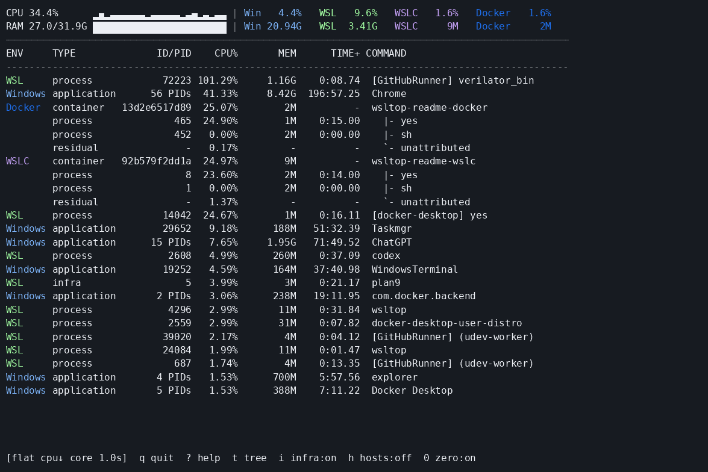

# wsltop

`wsltop` is a unified Windows, WSL, WSL Containers (WSLC), and Docker resource monitor for WSL2. It combines host and guest observations on one host-wide CPU scale and can explain the workload behind WSL virtual-machine CPU use.

> Windows Task Manager says `VmmemWSL` is busy. `wsltop` shows which Windows, WSL, WSLC, or Docker workload is responsible.

`wsltop` provides a one-shot CLI on both Windows and WSL. The terminal UI currently runs from WSL; Windows-native TUI support is the next migration stage. A graphical UI is outside the current scope.



## Why wsltop?

Task Manager may show only a VM aggregate such as `VmmemWSL 35%`. That identifies the host process, but not the guest workload. `wsltop --tree` makes the hierarchy visible:

```text
WSL VM
|- process    verilator
`- infra      plan9

Docker
`- container  build
   |- process compiler
   `- unattributed
```

Parent and child CPU values are attribution views, not values to add together.

## Features

- Windows native process monitoring
- Current WSL distribution process monitoring through `/proc`
- Multiple running WSL distribution monitoring
- WSL Containers monitoring
- Docker and WSLC container monitoring with in-container process attribution
- WSL and WSLC host attribution trees with an `unattributed` remainder
- Host-wide CPU normalization: all environments use Windows host logical CPUs = 100%
- Interactive terminal UI with flat/tree views, scrolling, and display toggles
- Flat and tree JSON output
- Resource classification as `process`, `container`, `infra`, or internal `host`
- Best-effort degradation when optional WSLC, Docker, or additional-distro collectors are unavailable

## Quick start

Install from [crates.io](https://crates.io/crates/wsltop) and start the TUI:

```console
cargo install --locked wsltop
wsltop --interactive
```

Alternatively, download the prebuilt Linux x86_64 archive and checksum from the
[latest release](https://github.com/adachi6k/wsltop/releases/latest), then:

```console
tar -xzf wsltop-v*-x86_64-unknown-linux-gnu.tar.gz
cd wsltop-v*-x86_64-unknown-linux-gnu
./wsltop --interactive
```

For a single sample:

```console
./wsltop --once
```

Run `./wsltop --help` for the complete option reference.

## What the TUI shows

The flat view is a host-wide activity ranking. Windows and WSL processes appear alongside Docker and WSLC containers. A container is ranked once by its total CPU; optional process rows are an indented explanation of that total, not extra CPU to add to it.

```text
flat | CPU 1 core = 100% | interval 3000ms

ENV     TYPE               ID/PID    CPU%       MEM      TIME+ COMMAND
-------------------------------------------------------------------------------------------------
Docker  container  68dae66282ff  11.99%      520M          -  act-CI-simulate...
        process           34692  11.75%      157M   62:03.46    |- simx
        residual              -   0.24%          -          -    `- unattributed
WSLC    container  5e0c144e6a3c   5.94%      348M          -  mighty_flinders
        process             806   5.71%       31M    4:12.08    |- cc1plus
        process             470   0.19%        6M    0:03.20    |- ninja
        residual              -   0.04%          -          -    `- unattributed
Windows application     3 PIDs   4.82%     1.24G  103:27.51  Teams
Windows application    12 PIDs   2.37%     1.68G  248:10.03  Chrome
Windows application        31460   1.20%      198M  178:27.95  Taskmgr
WSL     infra                 5   0.05%        4M    0:14.82  plan9
```

In this example, `simx 11.75%` is included in its Docker container's `11.99%`; the values must not be added. Containers keep their position according to total container CPU, while their processes are sorted within the container. Windows rows are ranked by application, so multi-process applications such as Teams and Chrome appear once. By default, at most five processes are shown per container and additional processes are summarized.

For a Windows application row backed by one observed process, `ID/PID` shows that process's real PID. Multi-process applications show `N PIDs` without extra punctuation. If a single member's PID is unavailable, wsltop falls back to `1 PID`. Tree view exposes individual process IDs, while JSON retains `pid: null` for application totals.

Press `t` to switch to the attribution tree and answer a different question: how much of each VM or container total can wsltop explain?

```text
Host logical CPUs: 16

WSL VM                                    3.20%
|- infra      plan9                       0.05%
|- process    codex                       0.18%
`- unattributed                           2.97%

Docker
`- container  act-CI-simulate...         11.99%
   |- process  simx                       11.75%
   `- unattributed                         0.24%
```

The default text/TUI scale treats one fully occupied logical CPU as `100%`; use `--cpu-scale host` for the Windows host-wide scale.

## Installation

Requirements:

- Windows 11 with WSL2
- For WSL-native execution, Windows interoperability enabled and PowerShell available as `powershell.exe`
- Optional: `wslc.exe` for WSL Containers data
- Optional: Docker CLI plus a reachable Docker daemon for Docker data

### Windows-native one-shot

Building on Windows produces `wsltop.exe`. It collects the primary WSL
distribution through `wsl.exe`, while Windows, WSLC, and Docker collectors run
from Windows. The primary distribution is selected in this order: `--distro
NAME`, the WSL default distribution, then the first running distribution.

```powershell
cargo build --release --locked
.\target\release\wsltop.exe --once
.\target\release\wsltop.exe --distro Ubuntu-24.04 --tree
```

Windows-native interactive mode is not enabled yet; run the TUI from WSL.

Install with Cargo (requires a Rust toolchain):

```console
cargo install --locked wsltop
```

Prebuilt Linux x86_64 archives and SHA-256 checksums are available from
[GitHub Releases](https://github.com/adachi6k/wsltop/releases/latest) and do not
require a Rust toolchain.

Build from source:

```console
git clone https://github.com/adachi6k/wsltop.git
cd wsltop
cargo build --release --locked
install -Dm755 target/release/wsltop ~/.local/bin/wsltop
```

## Usage

The default and `--once` modes take two cumulative CPU snapshots separated by `--interval-ms` and print one table.

```console
wsltop [OPTIONS]

--once                 Take one sampled measurement (default)
-i, --interactive      Run the continuously updating terminal UI
--json                 Emit JSON; incompatible with --interactive
--tree                 Show CPU attribution; selects the initial TUI view
--limit N              Limit flat resources (default: 30)
--interval-ms N        Sampling/refresh interval (default: 3000, minimum: 100)
--show-wsl-host        Show raw vmmem/vmmemWSL/vmmemwslc-* rows in flat views
--wsl-only             Skip Windows, additional-distro, and WSLC collectors
--no-wslc              Disable WSLC collection
--no-docker            Disable Docker collection
--show-container-processes Include Docker/WSLC processes (default for text/TUI)
--hide-container-processes Hide Docker/WSLC processes from flat output
--container-process-limit N Show at most N processes per container (default: 5)
--cpu-scale core|host CPU display scale for text/TUI output (default: core)
--hide-infra           Hide infrastructure rows
```

Options that affect collection or the initial view also apply to interactive mode. `--once` remains an explicit alias for the default one-shot behavior.

## Interactive TUI

Start the terminal UI with `wsltop --interactive`. It draws immediately and accepts partial collector updates instead of waiting for every source. Current-WSL `/proc` data uses a fixed 150 ms startup warmup, then the configured interval. While Windows host discovery is pending, non-Windows collectors use the WSL-visible CPU count and are marked provisional. If the Windows-reported count differs, provisional rows are discarded and repopulated on the host-wide scale; delayed results carrying the old normalization count are ignored. `--wsl-only` explicitly keeps the WSL-visible scale. Windows collection runs independently; additional WSL distributions, WSLC, and Docker refresh on a slower cadence (at least two seconds), so a slow optional collector cannot serialize local sampling.

The TUI retains each collector's last successful result. While collectors start, the footer reports `loading`; after a collector error its previous rows remain visible and the footer reports the error. Docker/WSLC aggregate rows are collected separately from internal process details. Details are enabled by default for text/TUI output and use a separate bounded queue and five-second command timeout, so slow process inspection does not block aggregate refreshes. Use `--hide-container-processes` to skip process rows in flat output.

Windows processes are ranked as application totals in human-readable flat/TUI output. Multi-process applications such as Teams, Chrome, and ChatGPT therefore occupy one top-level row. Tree output expands each application into its contributing PIDs. WebView2 ownership uses current parent-PID evidence plus CIM command-line/package metadata; ambiguous helpers remain under a conservative `WebView2` application instead of being assigned by guess. Metadata discovery runs independently in interactive mode and retains its last successful result across transient failures.

Controls:

| Key | Action |
| --- | --- |
| `q`, `Esc` | Quit |
| Up/Down, Page Up/Page Down | Scroll |
| `t` | Toggle flat/tree view |
| `i` | Toggle infrastructure rows |
| `h` | Toggle raw WSL host rows in flat view |
| `0` | Toggle zero-CPU rows |

Terminal raw mode, alternate-screen state, and cursor visibility are restored on normal exit and propagated errors.

## CPU display and accounting

Text and TUI output default to the familiar Linux `top` convention where one fully busy logical CPU is 100%; multi-threaded workloads can exceed 100%. Use `--cpu-scale host` for the Task Manager-style whole-host display where all Windows host logical CPUs together equal 100%.

Internally, every CPU percentage remains on the common host-wide denominator. Display scaling is applied only while rendering, so sorting, attribution, residual accounting, and JSON values do not change.

Windows and WSL process percentages come from deltas of cumulative processor time. WSLC and Docker percentages are normalized from their collector-specific values onto the same host scale. See [CPU accounting](docs/cpu-accounting.md) for formulas and caveats.

`TIME+` is cumulative CPU time consumed, formatted as unbounded minutes, seconds, and hundredths (`MM:SS.hh`), as in Linux `top`; it is not wall-clock process age. Windows application TIME+ is the sum of its currently observed member processes. Process rows report TIME+ where their collector exposes it. Container totals and residual rows show `-` because wsltop does not infer cumulative time from point-in-time container percentages.

## Attribution tree

Use `--tree` to treat `vmmem`, `vmmemWSL`, and `vmmemwslc-*` as parent resources:

```text
Host logical CPUs: 16 | CPU scale: 1 core = 100%

WSL VM                                  131.20%
|- infra      plan9                      43.20%
|- process    codex                       3.20%
`- unattributed                          84.80%
```

The remainder is clamped at zero:

```text
unattributed = max(host CPU - known child CPU, 0)
```

Children are never proportionally scaled to fit a parent. If independently timed samples make children exceed the host value, the internal tree records sampling skew. Memory is displayed as resource data only; host-minus-child memory attribution is not performed.

Raw WSL host processes stay hidden in default flat output to avoid accidental double-counting. `--show-wsl-host` exposes them for diagnostics; tree mode always collects them for use as parents.

## Docker / WSLC behavior

WSLC collection uses the current/default CLI session. A single available `vmmemwslc-*` host can be associated with its containers. If multiple hosts make the mapping ambiguous, `wsltop` reports the mapping as unresolved and does not guess; flat WSLC rows remain available.

Docker collection is optional. Container CPU and memory come from Docker statistics. For each container, `docker top <id> -eo pid,ppid,pcpu,rss,time,comm,args` independently discovers processes in the Docker daemon's PID namespace. Process `%CPU` is divided by the Windows host logical CPU count and processes are nested under their container. `unattributed` and `over_attributed` residuals are calculated without scaling process values to fit the container. If the process backend does not support `time`, wsltop retries the older column set and leaves TIME+ unavailable instead of dropping the container detail.

Docker Desktop containers run in Docker Desktop's own Linux VM, so they are shown under an independent top-level `Docker` group. They are not manufactured as children of the current WSL VM. The legacy current-WSL PID-matching path is used only if sharing of the host PID namespace has been positively established; the current Docker Desktop path does not make that claim. Text/TUI output includes Docker and WSLC process rows by default while preserving each container row; use `--hide-container-processes` to suppress them (`--show-docker-processes` remains a compatibility alias). Flat ranking and `--limit` treat each container as the top-level resource; its processes and residual are displayed directly beneath it and are not independently ranked or counted toward the limit. Each container shows its top five processes by default; `--container-process-limit` changes that cap and omitted processes are summarized by count and combined CPU (`--docker-process-limit` remains an alias).

A missing `wslc.exe`, missing Docker CLI, or recognized unavailable Docker daemon is treated as an expected absence: its rows are silently omitted and monitoring continues. Unexpected command, output, parse, or per-container attribution failures are reported through the common warning path. Use `--no-wslc` or `--no-docker` to disable a collector intentionally.

## Windows application grouping

Application CPU is exactly the sum of observed member-process CPU; child PIDs explain the application total and must not be added to it. Ordinary processes fall back to conservative executable-name grouping. A WebView2 process joins another application only when command-line, package, or a currently matching parent process provides unambiguous evidence.

## Multiple WSL distributions

The current distribution is sampled directly from `/proc`. Other running distributions are discovered with `wsl.exe --list --running --quiet`, sampled through `wsl.exe -d`, and labelled with their distribution name. These remote samples are best-effort and introduce more timing skew than direct `/proc` access.

`--wsl-only` intentionally limits collection to the current distribution. It cannot obtain the Windows host CPU count or host resources, so output warns that CPU normalization and host attribution are limited.

## JSON output

`--json` preserves the PID-level flat resource-array schema and host-wide CPU values. Windows application rows are a human-readable view and do not replace existing Windows PID objects in flat JSON. Each resource includes fields such as `environment`, `kind`, identity, CPU percentage, and memory bytes. When known, cumulative CPU time is added as `cpu_time_seconds`; the field is omitted when unavailable. `--cpu-scale core` is rejected with JSON because display scaling does not alter machine-readable values; omitted scale or `--cpu-scale host` is accepted.

```console
wsltop --once --json
```

`--tree --json` emits a structured object containing `host_logical_cpu_count`, attribution groups, additive Windows application groups, Docker subgroups, unmapped children, `unattributed_cpu_percent`, and sampling-skew information.

JSON is a one-shot interface; `--interactive --json` is rejected explicitly.

## Limitations

- Sampling is best effort. Linux, PowerShell, WSLC, Docker, and remote-distro snapshots are not captured atomically.
- PowerShell process collection adds latency, but runs independently of other interactive collectors; the Windows logical CPU count is cached after its first successful query.
- WSLC session attribution is deliberately conservative when multiple host mappings are possible.
- Docker process `%CPU` from `docker top` is a ps-style lifetime/decay average and may not align precisely with interval-sampled container or `/proc` CPU.
- Memory values from Windows, WSLC, and Docker have different meanings and are not attributed by subtraction.
- This is a WSL2-hosted CLI/TUI, not a native Windows executable or GUI.

## Documentation

- [Architecture](docs/architecture.md)
- [CPU accounting](docs/cpu-accounting.md)
- [Validation and test plan](docs/test-plan.md)
- [Changelog](CHANGELOG.md)
- [Contributing](CONTRIBUTING.md)
- [Security policy](SECURITY.md)

## Development

```console
cargo fmt --all -- --check
cargo test --locked --all-targets
cargo clippy --locked --all-targets --all-features -- -D warnings
cargo build --release --locked
cargo package --locked
```

CI runs portable build, lint, test, and help/version smoke checks on Ubuntu. Windows/WSL interoperability, WSLC, Docker, attribution accuracy, and terminal recovery require real-host validation; see the test plan.

## License

Licensed under the [MIT License](LICENSE).
